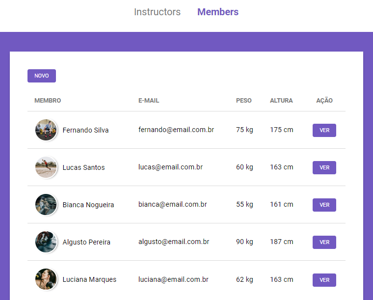

<h1 align="center">
  
</h1>

<h3 align="center">
  Controle de Academia
</h3>

Criação de um sistema para controle de academia

  <a href="#como-executar-o-projeto">Como executar o projeto</a>

 

  

## Como executar o projeto

- Requisitos
  - [Node.js](https://nodejs.org)
- Execute `git clone https://github.com/eliasmcastro/rocketseat-bootcamp-launchbase-controle-academia.git` para clonar este repositório
- Execute `cd rocketseat-bootcamp-launchbase-controle-academia` para entrar na pasta
- Execute `npm install` para instalar as dependências do projeto
- Execute `npm start` para iniciar o servidor de desenvolvimento
- Acesse http://localhost:3000
